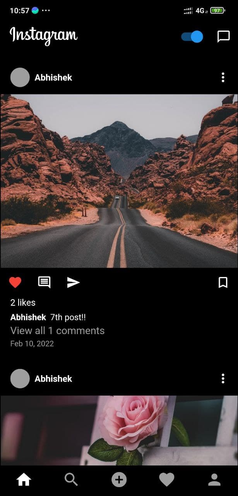

# Instagram Clone

A completely Responsive Instagram clone App- Works on Android, iOS & Web! 

## Features
- Responsive Instagram UI
- Email & Password Authentication
- Share Posts with Caption
- Display Posts with Caption
- Like & Comment on Posts
- Search Users
- Follow Users
- Display User Posts, Followers & Following
- EVERYTHING REAL TIME
- Sign Out

## ScreenShot

&nbsp;
&nbsp;&nbsp;
&nbsp;&nbsp;
&nbsp;

https://user-images.githubusercontent.com/52146654/154000719-962d0c0a-48e0-4d59-aad8-d1d50c9c49d4.mp4


## Installation
After cloning this repository, migrate to ```instagram-flutter-clone-App``` folder. Then, follow the following steps:
- Create Firebase Project
- Enable Authentication
- Make Firestore Rules
- Create Android, iOS & Web Apps
- Take Web FirebaseOptions and put it in main function in main.dart file replacing my keys (My keys wont work as I deleted my project)
Then run the following commands to run your app:
```bash
  flutter pub get
  open -a simulator (to get iOS Simulator)
  flutter run
  flutter run -d chrome --web-renderer html (to see the best output)
```

## Tech Used
**Server**: Firebase Auth, Firebase Storage, Firebase Firestore

**Client**: Flutter, Provider
    
## Feedback

If you have any feedback, please reach out to me at abhisheksolanki19111999@gmail.com

